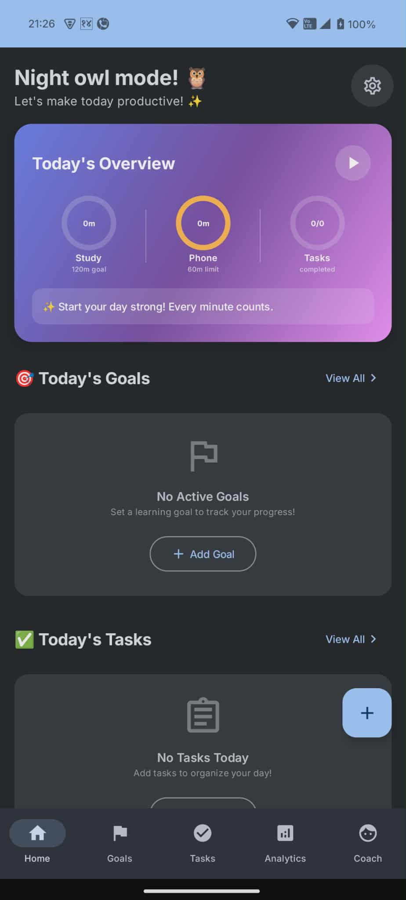
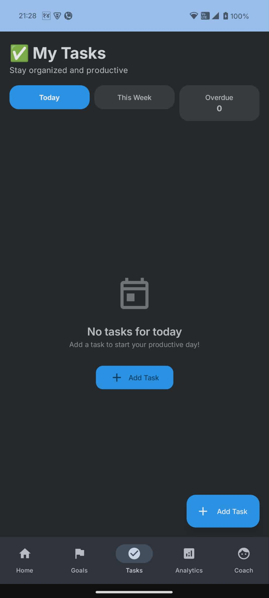
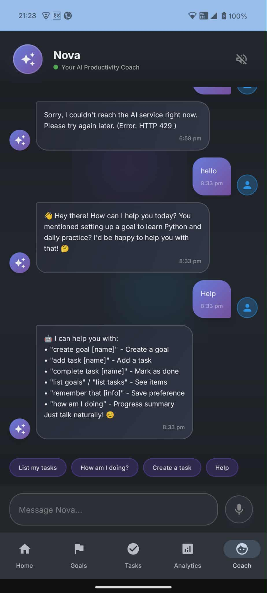
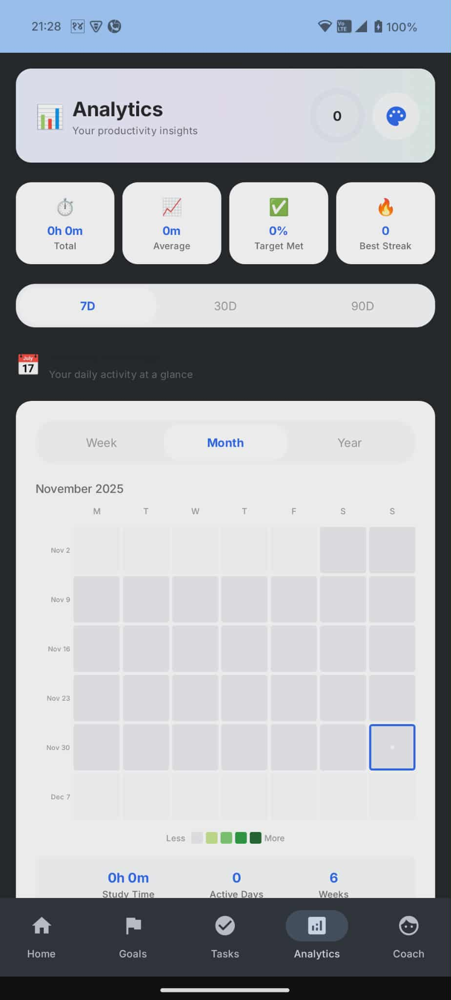
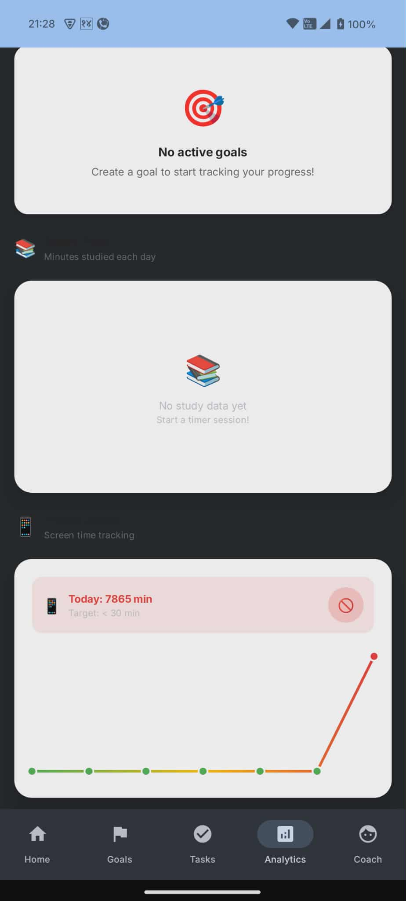

# 🎯 AI Goal & Habit Tracker

A modern, privacy-focused Android application designed to help you track goals, manage daily tasks, and boost productivity with the help of an on-device AI coach.

Built with **Kotlin** and **Jetpack Compose**, featuring local LLM inference using **llama.cpp**.

## ✨ Key Features

*   **🏠 Smart Dashboard**: Get a clear overview of your daily progress, active goals, and upcoming tasks at a glance.
*   **🤖 On-Device AI Coach**: Chat with a private AI assistant that runs entirely on your phone. Get advice on planning, breaking down goals, and staying motivated without your data leaving the device.
*   **🎯 Goal Management**: Set long-term goals, define deadlines, and track your journey.
*   **✅ Task Tracking**: Organize your day with tasks linked to your larger goals.
*   **📊 Advanced Analytics**: Visualize your productivity with detailed charts and progress reports.
*   **⏱️ Focus Timer**: Built-in timer to help you stay focused during work sessions.
*   **🔒 Privacy First**: No cloud servers. Your goals, chats, and data stay 100% local.

## 📱 App Screenshots

| **Home Dashboard** | **Goal Tracking** | **Daily Tasks** |
|:---:|:---:|:---:|
|  |  |  |

| **AI Assistant** | **Analytics Overview** | **Detailed Stats** |
|:---:|:---:|:---:|
|  |  |  |

## 🛠️ Tech Stack

*   **Language**: Kotlin
*   **UI Framework**: Jetpack Compose (Material 3)
*   **Architecture**: MVVM (Model-View-ViewModel)
*   **Local Database**: Room (SQLite)
*   **AI Engine**: [llama.cpp](https://github.com/ggerganov/llama.cpp) (via JNI) for running GGUF models locally
*   **Concurrency**: Kotlin Coroutines & Flow
*   **Navigation**: Jetpack Navigation Compose

## 🚀 Getting Started

### Prerequisites
*   Android Studio Hedgehog or newer
*   Android SDK 34
*   NDK (Side-by-side) for building the C++ AI engine

### Installation
1.  Clone the repository:
    ```bash
    git clone https://github.com/Madhav-Paudel/TO-DO-APP.git
    ```
2.  Open the project in **Android Studio**.
3.  Sync Gradle files.
4.  Build and run on an Android device or emulator.

### Setting up the AI Model
To use the AI features, you need to download a GGUF model file (e.g., Llama-3-8B-Quantized or Gemma-2b) and place it in the app's storage, or use the in-app **Model Manager** to download one.

## 🤝 Contributing

Contributions are welcome! Please feel free to submit a Pull Request.

## 📄 License

This project is licensed under the MIT License - see the [LICENSE](LICENSE) file for details.
